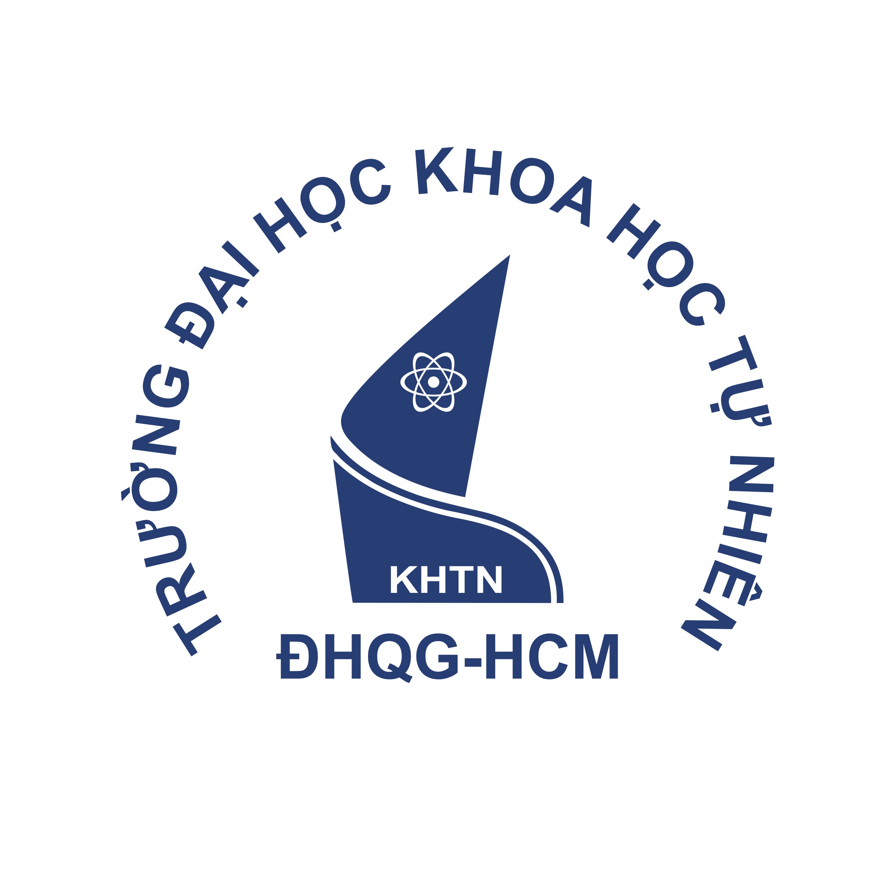

## ABOUT ME

- Data Analyst in Ho Chi Minh City, building toward Data Engineering.
- Scrape API from Ecommerce; deliver Power BI dashboards.
- Turned top-200 marketplace crawls into a CEO's import decision.
- Now: Data Engineering program and AWS Certified Data Engineer.

## LANGUAGES & TOOLS

| Category | Technologies |
|---|---|
| **Programming** |  Python &nbsp;•&nbsp;  SQL |
| **Big Data** |  Spark (PySpark) &nbsp;•&nbsp;  dbt &nbsp;•&nbsp;  ClickHouse |
| **Cloud Platform** |  GCP (BigQuery) |
| **ETL & Orchestration** |  Airflow |
| **Data Modeling** | Star Schema &nbsp;•&nbsp; SCD &nbsp;•&nbsp; OLAP &nbsp;•&nbsp; Metadata-driven ETL |
| **DevOps** |  Docker |
| **BI Tools** |  Power BI |
| **Automation & AI** | BeautifulSoup &nbsp;•&nbsp;  Playwright &nbsp;•&nbsp;  n8n &nbsp;•&nbsp;  AI-assisted tools (Anthropic API) |

## ACTIVITIES

<picture>
  <source
    srcset="https://github.pumbas.net/api/contributions/wayneworkspace?colour=7DD3FC&bgColour=0D1117&dotColour=E0F2FE&days=30"
    media="(prefers-color-scheme: dark)"
  />
  
</picture>

## EDUCATION

<table width="100%">
    <tr>
        <td width="120" align="center" valign="middle">
            
        </td>
        <td valign="middle">
            <strong>University of Science — VNUHCM (HCMUS)</strong>
             
            <strong>Bachelor of Engineering in Electronics and Telecommunications</strong>
             
            Ho Chi Minh City, Vietnam
        </td>
    </tr>
</table>

---
        
